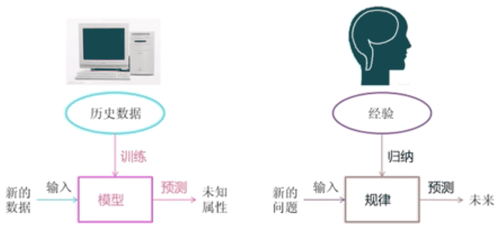
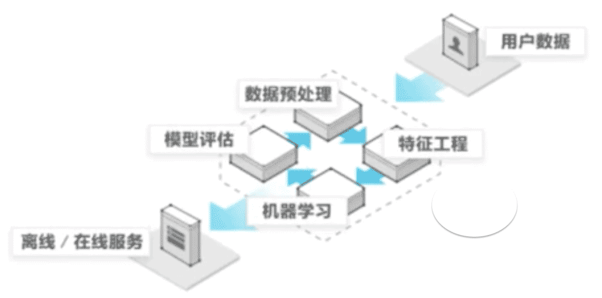
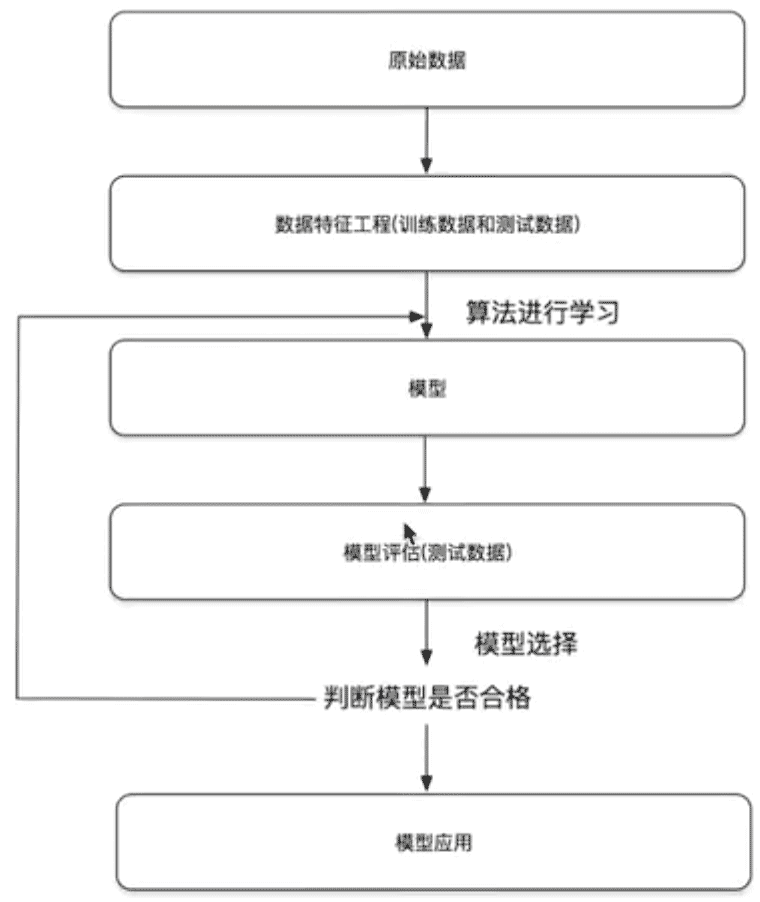

# 人工智能 (AI)

Artificial Intelligence

## 1. 概述

简单来说，人工智能 (AI) 是指可模仿人类智能来执行任务，并基于收集的信息对自身进行迭代式改进的系统和机器。AI 具有多种形式。例如：

* 聊天机器人使用 AI 更快速高效地理解客户问题并提供更有效的回答

* 智能助手使用 AI 来解析大型自由文本数据集中的关键信息，从而改善调度

* 推荐引擎可以根据用户的观看习惯自动推荐电视节目

AI 更多的是一种为超级思考和数据分析而服务的过程和能力，而不是一种格式或功能。在不少人看来，AI 意味着高功能的类人机器人接管世界。事实上，AI 的初衷并不是要取代人类，它旨在大幅增强人类的能力和贡献。这一特点使它成为了现代企业的一项非常宝贵的资产。

### 1.1 人工智能、机器学习与深度学习


**机器学习**是**人工智能**的一个实现途径

**深度学习**是一个**机器学习**的方法（人工学习网络）发展而来


### 1.2 作用

传统预测、图像识别、自然语言处理

### 1.3 机器学习



#### 1.3.1 定义

从**数据**中自动分析获取**模型**（得出结果/规律），并利用模型对**未知数据**进行预测（解决实际问题）。

#### 1.3.2 数据集的构成

特征值 + 目标值

#### 1.3.3 机器学习算法分类

根据目标值分类

* 目标值：类别 - 分类问题（如猫狗图片识别）

* 目标值：连续型的数据 - 回归问题

* 目标值：无 - 无监督学习

|目标值|问题归类|算法|
|:--:|:--:|:--:|
|类别|分类问题(监督学习)|k-临近算法(k-nearest neighbor,k-NN)、贝叶斯分类(Naive Bayes classifier)、决策树(Decision Tree)与随机森林(Random forest)、罗辑回归(Logistic Regression)|
|连续型的数据|回归问题(监督学习)|线性回归(Linear Regression)、岭回归(Ridge regression, Tikhonov regularization)|
|无|无监督学习|聚类(Cluster analysis)、k-means|

**监督学习**: Supervised learning `分类、回归`。输入数据有特征**有标签**，即有标准答案。

**无监督学习**：Unsupervised learning `聚类`。输入数据有特征**无标签**，即无标准答案。

#### 1.3.4 开发流程



* 获取数据
* 数据处理
* 特征工程
* 机器学习算法训练 - 模型
* 模型评估（没有问题，开始应用；反之则重复前面的数据处理、特征工程、获取模型等步骤）
* 应用



#### 1.3.5 学习框架和资料

* **算法**是核心，**数据**与**计算**是基础
* 找准定位

大部分复杂模型的算法设计都是算法工程师在做，而我们
* 分析很多数据
* 分析具体的业务
* 应用常见算法
* 特征工程、调参数、优化


```python
# getting-started/demo-001.py
```

## 2.1 数据集

分为**训练集**和**测试集**


https://www.kaggle.com/datasets

http://archive.ics.uci.edu/ml

https://scikit-learn.org/stable/datasets

### 2.1.1 可用数据集

公司内部数据、第三方数据接口、免费数据集等

### 2.1.2 scikit-learn数据集


### 2.1.3 数据集的划分

训练数据：用于训练，构建模型。

测试数据：在模型验证时使用，用于评估模型是否有效。占比数据的20%～30%

```python
# 测试API
from sklearn.model_selection import train_test_split

# train_test_split(arrays, *options)
# return 训练集特征值，测试集特征值，训练集目标值，测试集目标值
```

## 2.2 特征工程(Feature Engineering)

业界广泛流传：数据和特征决定了机器学习的上限，而模型和算法只是逼近这个上限而已。

特征工程包含内容：特征抽取、特征预处理、特征降维

### 2.2.1 特征工程的位置与数据处理的比较

pandas：一个数据读取非常方便，以及基本的处理格式的工具

sklearn：对于特征的处理提供了强大的接口

### 2.2.3 特征抽取/提取

机器学习算法 - 统计方法 - 数学公式

> 文本 -》 数值
>类型 -》 数值

* 将任意数据（如文本或图像）转换为可用于机器学习的数字特征

> 特征值化是为了计算机更好的去理解数据。

字典特征提取（特征离散化）
文本特征提取
图像特征提取（深度学习中介绍）

```
# 特征提取API
sklearn.feature_extraction

# 字典特征提取
sklearn.feature_extraction.DictVectorizer(sparse=True)
# vector 数学：向量 物理：矢量
#   矩阵 matrix 二维数组
#   向量 vector 一维数组
```

```python
# getting-started/demo-002.py
```


### 2.2.4 特征预处理

通过一些**转换函数**将特征数据转换成更加适合**算法模型**的特征数据的过程。

数值型数据的**无量纲化**：**归一化**和**标准化**

```
sklearn.preprocessing
```


### 2.2.5 特征降维

## 参考资料

https://www.bilibili.com/video/BV1nt411r7tj?p=1

https://www.oracle.com/cn/artificial-intelligence/what-is-ai/

