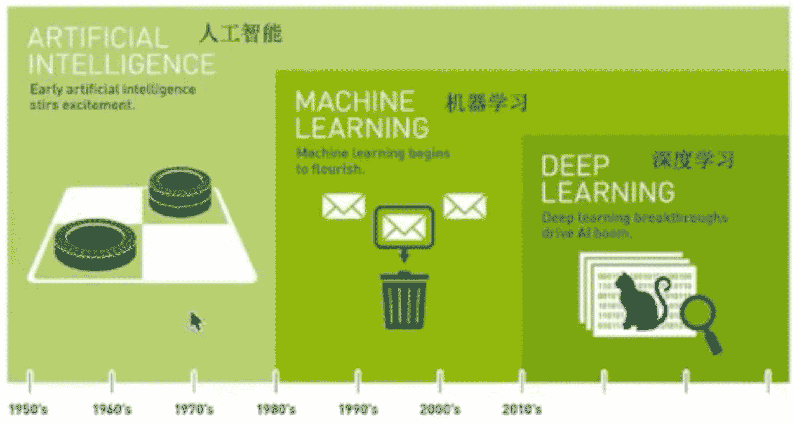
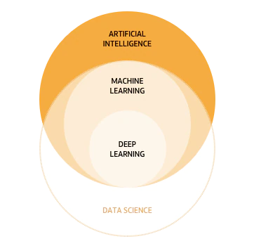

# 人工智能 (AI)

Artificial Intelligence

## 概述

简单来说，人工智能 (AI) 是指可模仿人类智能来执行任务，并基于收集的信息对自身进行迭代式改进的系统和机器。AI 具有多种形式。例如：

* 聊天机器人使用 AI 更快速高效地理解客户问题并提供更有效的回答

* 智能助手使用 AI 来解析大型自由文本数据集中的关键信息，从而改善调度

* 推荐引擎可以根据用户的观看习惯自动推荐电视节目

AI 更多的是一种为超级思考和数据分析而服务的过程和能力，而不是一种格式或功能。在不少人看来，AI 意味着高功能的类人机器人接管世界。事实上，AI 的初衷并不是要取代人类，它旨在大幅增强人类的能力和贡献。这一特点使它成为了现代企业的一项非常宝贵的资产。

### 人工智能、机器学习与深度学习

**机器学习**是**人工智能**的一个实现途径

**深度学习**是一个**机器学习**的方法（人工学习网络）发展而来

### 作用

传统预测、图像识别、自然语言处理

## 机器学习

### 定义

从**数据**中自动分析获取**模型**（得出结果/规律），并利用模型对**未知数据**进行预测（解决实际问题）。

### 数据集的构成

特征值 + 目标值

### 机器学习算法分类

根据目标值分类

* 目标值：类别 - 分类问题（如猫狗图片识别）

* 目标值：连续型的数据 - 回归问题

* 目标值：无 - 无监督学习

|目标值|问题归类|算法|
|:--:|:--:|:--:|
|类别|分类问题(监督学习)|k-临近算法(k-nearest neighbor,k-NN)、贝叶斯分类(Naive Bayes classifier)、决策树(Decision Tree)与随机森林(Random forest)、罗辑回归(Logistic Regression)|
|连续型的数据|回归问题(监督学习)|线性回归(Linear Regression)、岭回归(Ridge regression, Tikhonov regularization)|
|无|无监督学习|聚类(Cluster analysis)、k-means|

**监督学习**: Supervised learning `分类、回归`。输入数据有特征**有标签**，即有标准答案。

**无监督学习**：Unsupervised learning `聚类`。输入数据有特征**无标签**，即无标准答案。

### 开发流程

* 获取数据
* 数据处理
* 特征工程
* 机器学习算法训练 - 模型
* 模型评估（没有问题，开始应用；反之则重复前面的数据处理、特征工程、获取模型等步骤）
* 应用

### 学习框架和资料

* **算法**是核心，**数据**与**计算**是基础
* 找准定位

大部分复杂模型的算法设计都是算法工程师在做，而我们
* 分析很多数据
* 分析具体的业务
* 应用常见算法
* 特征工程、调参数、优化

## 参考资料

https://www.bilibili.com/video/BV1nt411r7tj?p=1

https://www.oracle.com/cn/artificial-intelligence/what-is-ai/

