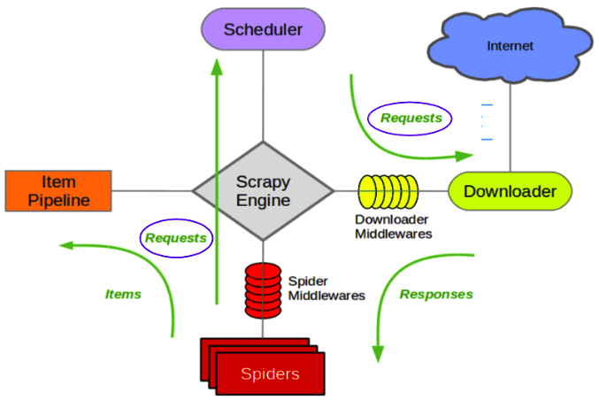

# Spider

### 抓取4步走

新建项目、明确目标、制作爬虫、存储内容

### 初始化项目

```
pip install scrapy

pip install pymongo
```

```
scrapy startproject douban
```

create spider

```
cd douban/douban/spiders

scrapy genspider douban_spider movie.douban.com
```

### Scrapy 

https://scrapy.org/

https://docs.scrapy.org/en/latest/index.html

https://docs.scrapy.org/en/latest/topics/media-pipeline.html



### Mongodb

https://www.mongodb.com/

Install MongoDB Community Edition on macOS

https://docs.mongodb.com/manual/tutorial/install-mongodb-on-os-x/

Mac 启动链接数据库

```
mongod --config /usr/local/etc/mongod.conf --fork
```

Mac 查看数据库自动创建/添加的内容

```
mongo

> show dbs
admin   0.000GB
config  0.000GB
douban  0.000GB
local   0.000GB
> use douban
switched to db douban
> show collections
douban_movie
> db.douban_movie.find()
```

### 视频教程

https://www.imooc.com/learn/1017