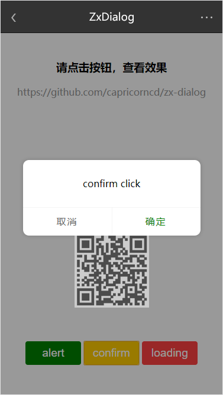

# zx-dialog

配合zx-editor `https://github.com/Capricorncd/zx-editor` 写的一个小dialog库。

支持：alert / confirm / loading

## install

```
# 安装依赖
npm install
# 开发模式
npm run dev
# 生产模式
npm run build
```

```
// localhost可换成你本地ip地址
http://localhost:9003
```



## USE

```
npm i zx-dialog -D
```

#### ES6+

```
import { ZxDialog } from 'zx-dialog'
```

#### browser

```
<script src="./dist/js/zx-dialog.min.js"></script>
```


#### example

```
const zxDialog = new ZxDialog({
  // 背景遮罩透明度
  maskOpacity: 0.4,
  // 确定按钮颜色
  confirmBtnColor: 'red',
  // 取消按钮颜色
  cancelBtnColor: 'green'
})

zxDialog.alert('alert click')
```

## methods

* alert(message, callback)

  消息提示

  ```
  zxDialog.alert('message', function () {
    // dosomething
  })
  ```

* confirm(message, callback)

  返回true或false

  ```
  zxDialog.confirm('message', function (result) {
    // dosomething
  })
  ```

* loading(message)

  loading

  ```
  zxDialog.loading('message')
  ```

* removeLoading()

  移除loading

  ```
  zxDialog.removeLoading()
  ```

* removeAll()

  移除所有已创建的dialog节点

## Copyright and license

Code and documentation copyright 2018. Capricorncd. Code released under the MIT License.
